# MoodCalendar
<!-- replace 'Project Title' with the title of your project -->
This project is a Mood Calendar Tracker application, designed to monitor and visualize an individual's mood over time. Users record their daily mood as either "Good," "Neutral," or "Bad," and these entries are stored persistently across sessions. The application then aggregates this data to provide visual insights on a calendar, with different colors corresponding to each mood. Additionally, it offers detailed statistics, such as the number of each type of mood and the average mood over the past month, year, and all time. By using this application, users can gain a better understanding of their emotional patterns and potentially identify triggers or trends.

## Team Members
<!-- list the names of your team members here -->
Ben Hicks

Summer Gasaway

## Required Skills
<!-- List the technical skills you needed to develop the application, the tools, or APIs (Platform specific and third party) used in the project -->
#### Xamarin.Forms: 

This is a cross-platform UI toolkit that allows developers to efficiently create native user interface layouts that can be shared across Android, iOS, and Windows Phones.

#### C# programming language: 

The entire application logic is written in C#, which is a widely-used, modern, and type-safe programming language.
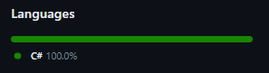

#### Model-View-ViewModel (MVVM) design pattern: 

This pattern helps to cleanly separate the business and presentation logic of an application from its UI and makes it easier to unit test.
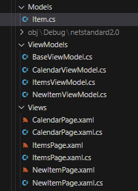

#### Data persistence / Xamarin.Essentials: 

Techniques for persisting data across sessions are used. In this application, Xamarin.Essentials Preferences and a Global variable are used for data storage.

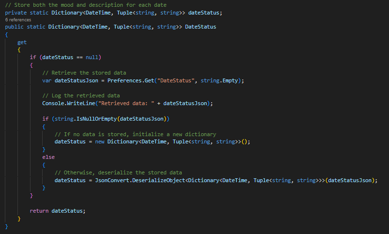

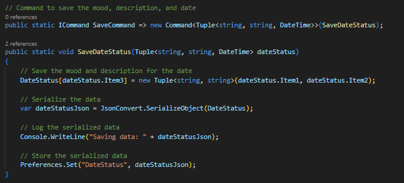

#### Color manipulation: 

Skills in color manipulation are required to create the mood color gradients in the calendar.

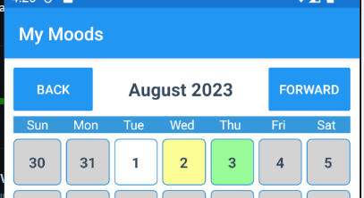

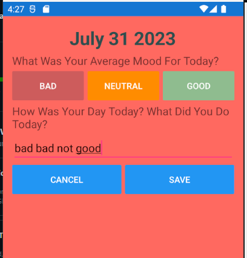

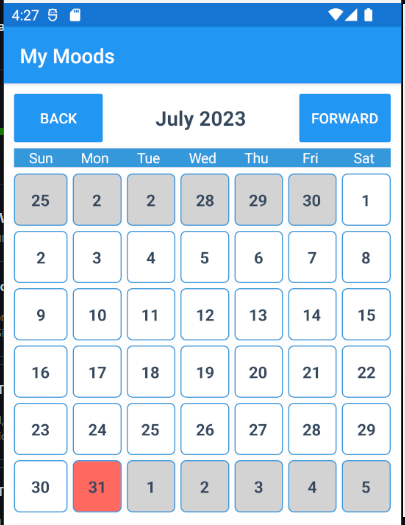

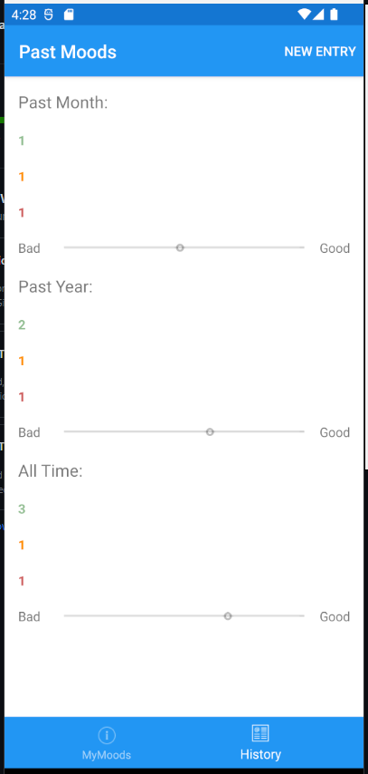

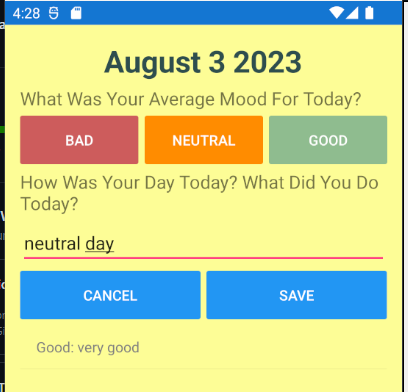

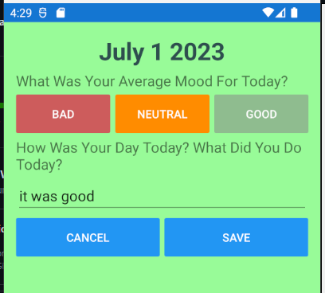

#### DateTime API: 

This API is used to manipulate dates and times, calculate durations, and format dates for display.
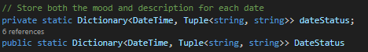

#### Newtonsoft.Json

We used this Nuget package to deserialize json information in our global variable class

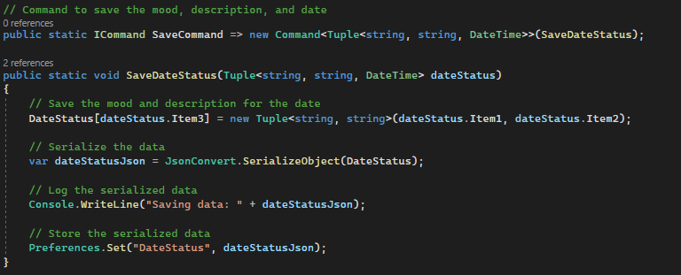
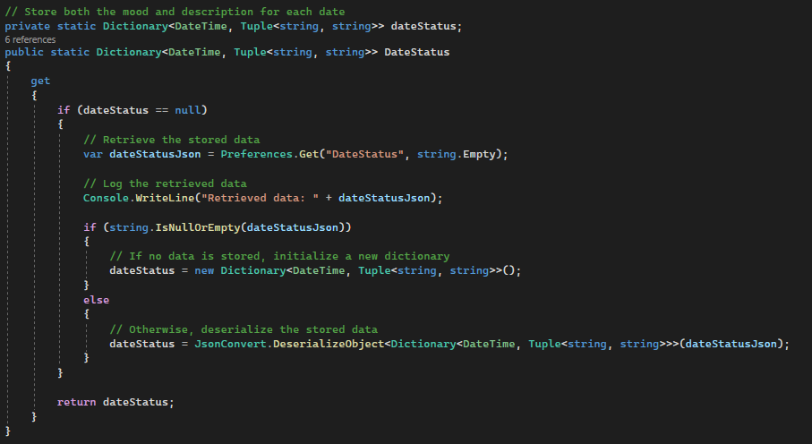

## Project Contributions
<!-- Describe each team member's contributions to the project -->
**Ben Hicks** - I worked on most of the backend of this project. so most of the button's functionality was implemented by me. Additionally, all of the mood data is set to a global variable and we used Xamarin.Essentials preferences to make it persist across sessions on each individual device

**Summer Gasaway** - I worked on most of the front-end design work, so how all the pages look and how all the buttons look were designed by me. Additionally, how each page links up to other pages throughout the application was all designed by me

## Rubric

*Project Submission - 160 points*
- [x] Complete project/solution submission - 160 points

*Documentation - 40 points*
- [x] [Project title](#moodcalendar) - 5 points
- [x] [Team member names](#team-members) - 5 points
- [x] [Project introduction](#moodcalendar) - 10 points
- [x] [Required skills](#required-skills) - 10 points
- [x] [Project contributions](#project-contributions) - 10 points
